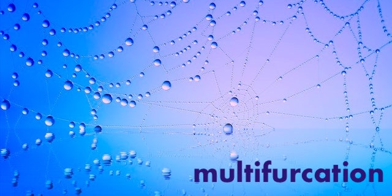

[](http://unlicense.org/)

[](https://github.com/ipoqto/multifurcation)
[](http://makeapullrequest.com)


[](http://ansicolortags.readthedocs.io/?badge=latest)
[](https://svgshare.com/i/Zhy.svg)
[](https://svgshare.com/i/ZjP.svg)
[](https://docker.com/)
[](https://hub.docker.com)
[](https://visualstudio.microsoft.com)




The `multifurcation` skeleton is a convention for a `cmake` structure with branched/nested subdivisions; it is based on the [Pitchfork](https://github.com/vector-of-bool/pitchfork) but with several modifications as discussed below. Consider this to be a starter kit for a `C++20` codebase that features numerous smaller and self-contained libraries as well as linter (`clang-format` & `clang-tidy`) and debugger (`gdb`) capabilities, documentation (`Doxygen`), containerisation (`Docker`), unit tests (`GoogleTest`) and CI/CD functionalities (`GitHub Actions`).

---

- [Introduction](#introduction)
- [Guide](#guide)
    - [Install](#install)
    - [Use](#use)
- [Future](#future)
- [Reference](#reference)

---

# Introduction

Lorem ipsum dolor sit amet, consectetur adipiscing elit, sed do eiusmod tempor incididunt ut labore et dolore magna aliqua. Ut enim ad minim veniam, quis nostrud exercitation ullamco laboris nisi ut aliquip ex ea commodo consequat. Duis aute irure dolor in reprehenderit in voluptate velit esse cillum dolore eu fugiat nulla pariatur. Excepteur sint occaecat cupidatat non proident, sunt in culpa qui officia deserunt mollit anim id est laborum.

---

# Guide

Lorem ipsum dolor sit amet, consectetur adipiscing elit, sed do eiusmod tempor incididunt ut labore et dolore magna aliqua. Ut enim ad minim veniam, quis nostrud exercitation ullamco laboris nisi ut aliquip ex ea commodo consequat. Duis aute irure dolor in reprehenderit in voluptate velit esse cillum dolore eu fugiat nulla pariatur. Excepteur sint occaecat cupidatat non proident, sunt in culpa qui officia deserunt mollit anim id est laborum.

## Install

Lorem ipsum dolor sit amet, consectetur adipiscing elit, sed do eiusmod tempor incididunt ut labore et dolore magna aliqua. Ut enim ad minim veniam, quis nostrud exercitation ullamco laboris nisi ut aliquip ex ea commodo consequat. Duis aute irure dolor in reprehenderit in voluptate velit esse cillum dolore eu fugiat nulla pariatur. Excepteur sint occaecat cupidatat non proident, sunt in culpa qui officia deserunt mollit anim id est laborum.

Local Download:
```shell
git clone https://www.github.com/ipoqto/multifurcation
```

Remote Container:
```
docker pull ipotqo/multifurcation:latest
```


## Use

Lorem ipsum dolor sit amet, consectetur adipiscing elit, sed do eiusmod tempor incididunt ut labore et dolore magna aliqua. Ut enim ad minim veniam, quis nostrud exercitation ullamco laboris nisi ut aliquip ex ea commodo consequat. Duis aute irure dolor in reprehenderit in voluptate velit esse cillum dolore eu fugiat nulla pariatur. Excepteur sint occaecat cupidatat non proident, sunt in culpa qui officia deserunt mollit anim id est laborum.

---

# Future

Lorem ipsum dolor sit amet, consectetur adipiscing elit, sed do eiusmod tempor incididunt ut labore et dolore magna aliqua. Ut enim ad minim veniam, quis nostrud exercitation ullamco laboris nisi ut aliquip ex ea commodo consequat. Duis aute irure dolor in reprehenderit in voluptate velit esse cillum dolore eu fugiat nulla pariatur. Excepteur sint occaecat cupidatat non proident, sunt in culpa qui officia deserunt mollit anim id est laborum.

---

# Reference

1. ...
2. ...
3. ...
